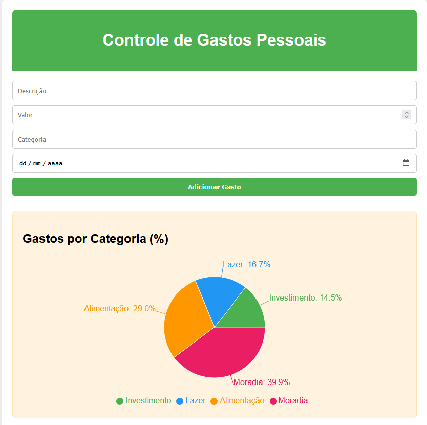

# 💸 Controle de Gastos Pessoais

Um app simples e funcional de controle de finanças pessoais, feito com **React**. Permite adicionar, visualizar, excluir e visualizar graficamente os seus gastos por categoria. Os dados são salvos no `localStorage`, garantindo persistência mesmo após fechar o navegador.

## 🚀 Funcionalidades

- ✅ Adicionar gastos com: descrição, valor, categoria e data
- ✅ Listar gastos em ordem cronológica
- ✅ Visualizar total geral e por categoria
- ✅ Gráfico de pizza com percentual por categoria (via Recharts)
- ✅ Excluir gastos individualmente
- ✅ Dados persistentes via LocalStorage (mesmo após F5 ou reinício do navegador)

## 🛠️ Tecnologias Utilizadas

- [React](https://react.dev/)
- [Vite](https://vitejs.dev/)
- [Recharts](https://recharts.org/)
- HTML + CSS
- LocalStorage (Web API)

## 📂 Estrutura do Projeto
controle-gastos/
├── public/
├── src/
│   ├── components/
│   │   ├── Header.jsx
│   │   ├── FormGasto.jsx
│   │   ├── ListaGastos.jsx
│   │   ├── Resumo.jsx
│   │   └── GraficoGastos.jsx
│   ├── App.jsx
│   ├── main.jsx
│   └── index.css
├── package.json
└── vite.config.js

## 📦 Instalação

    Clone o repositório - git clone https://github.com/seu-usuario/controle-gastos.git
    
    Acesse a pasta - cd controle-gastos
    
    Instale as dependências - npm install
    
    Inicie o servidor de desenvolvimento - npm run dev
    
    Acesse em http://localhost:5173

## 📷 Preview

📌 Aprendizados

O projeto foi construído como parte da minha evolução prática em React. Os principais focos foram:

    Estruturação de componentes reutilizáveis

    Gerenciamento de estado com useState e useEffect

    Integração com localStorage

    Visualização de dados com Recharts

    Boas práticas de organização e semântica

👨‍💻 Autor

Desenvolvido por Iago Alves, estudante dedicado à transição de carreira para a área de TI.
Projeto criado como parte de sua prática em React e construção de portfólio.

GitHub: https://github.com/IagoAlves2

Este projeto não possui licença no momento. Sinta-se à vontade para estudá-lo, aprender com ele e se inspirar.
